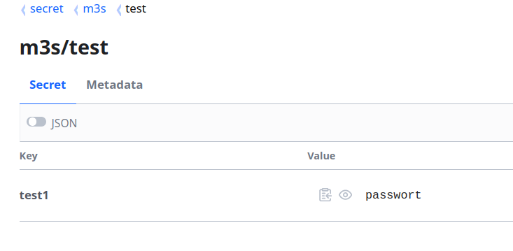

# How to use Hashicorp Vault with mesos-compose

Mesos-Compose support to store secrets in Hashicorp Vault (short vault). The configuration is so simple as possible.

## 1. Set the environment parameter

Therefore mesos-compose can use vault, we have to configure the following parameter.

```bash

export VAULT_URL=https://<YOUR_VAULT_IP>:<YOUR_VAULT_PORT>
export VAULT_TOKEN=<YOUR_VAULT_TOKEN>

```

## 2. Create a secret in Vault

Create a secret in a KV store.



## 3. Use the secret

Use the secret in the following term.

`vault://<SECRET_PATH>:<KEY_NAME>`

As example:

```yaml
version: '3.9'
services:
  test1:
    image: alpine
    command: "env"
    restart: always
    environment:
      - test=vault://secret/data/m3s/test:test1
    network: default
    deploy:
      resources:
        limits:
          cpus: "0.1"
          memory: "50"

```

Please notice, that the KV V2 store needs "data" inside of the path. Even if it's not visible in the UI.
          
